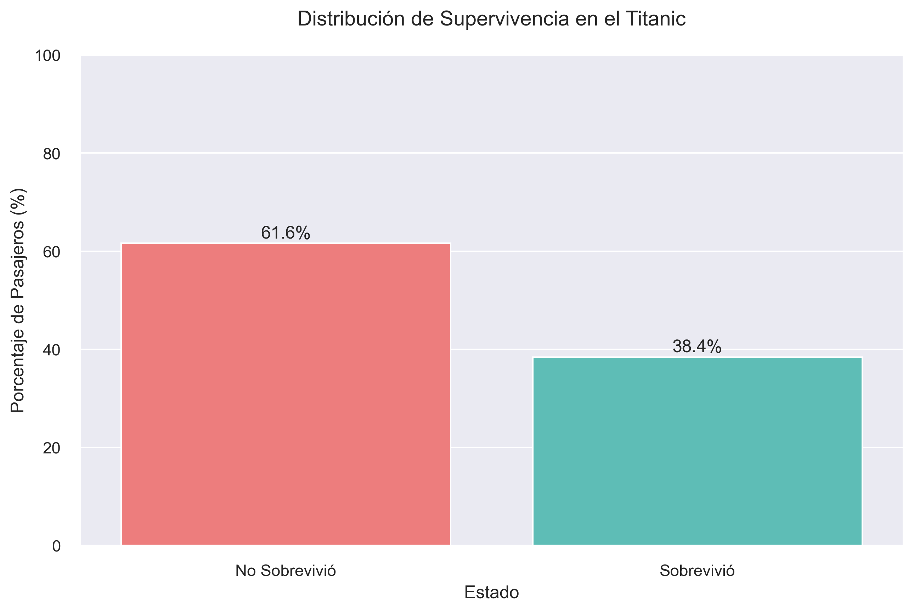
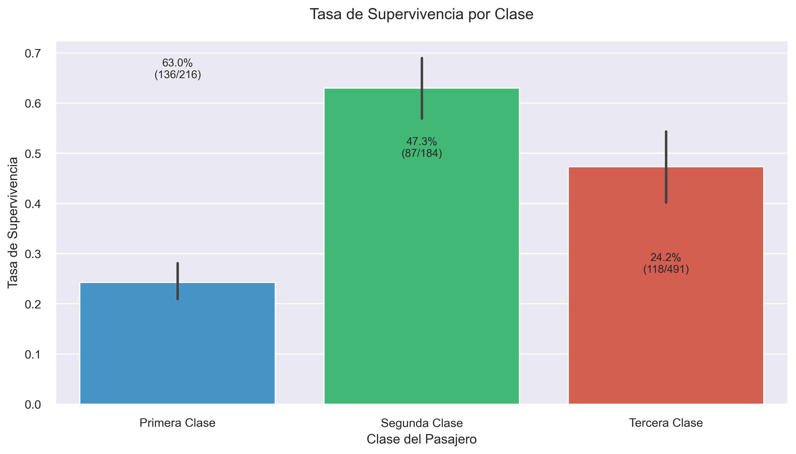

# 🚢 Análisis del Desastre del Titanic

Este repositorio contiene un análisis exhaustivo del desastre del Titanic, incluyendo visualizaciones, estadísticas y conclusiones detalladas.

## 📊 [Ver el Análisis Completo](output/titanic_analysis_report.md)

### 🔍 Contenido Principal

- Análisis demográfico detallado
- Patrones de supervivencia
- Análisis socioeconómico
- Análisis familiar
- Visualizaciones interactivas
- Conclusiones y hallazgos clave

### 📈 Visualizaciones Destacadas

<div align="center">
  
  
</div>

### 🛠️ Estructura del Proyecto

```
├── datasets/           # Datos originales del Titanic
├── output/            
│   ├── images/        # Visualizaciones generadas
│   └── reports/       # Reportes de análisis
├── src/               # Código fuente
│   ├── data_loader.py
│   ├── eda.py
│   └── ...
└── notebooks/         # Jupyter notebooks
```

### 📝 Metodología

Este análisis utiliza Python y diversas bibliotecas de análisis de datos para examinar los patrones de supervivencia en el desastre del Titanic. Las principales herramientas incluyen:

- pandas para manipulación de datos
- matplotlib y seaborn para visualizaciones
- numpy para cálculos estadísticos

### 🔗 Recursos Adicionales

- [Documentación Completa](output/titanic_analysis_report.md)
- [Notebooks de Análisis](titanic.ipynb)

## 📫 Contacto

Para preguntas o sugerencias, no dudes en abrir un issue en este repositorio.

> Este proyecto es parte de un análisis exhaustivo del desastre del Titanic.
